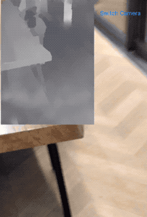
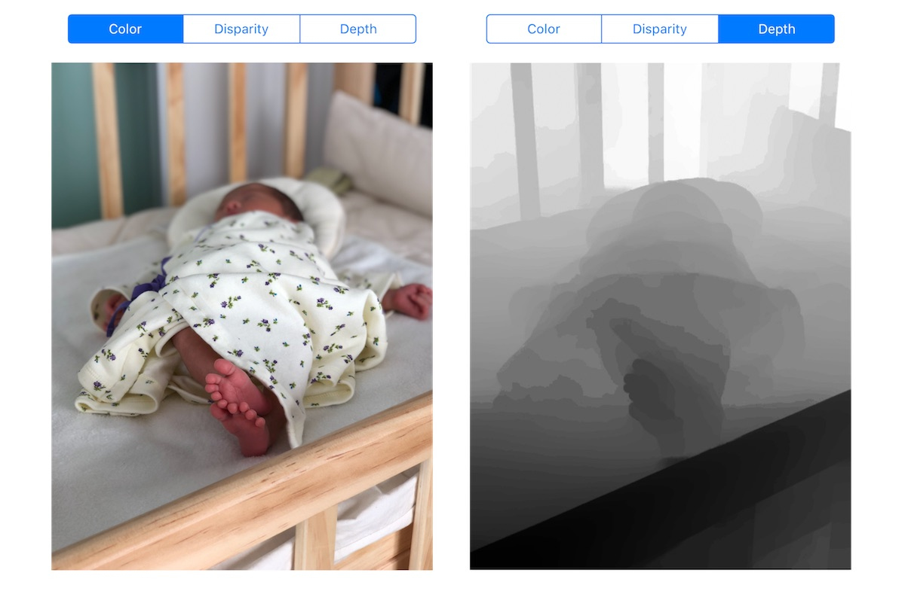
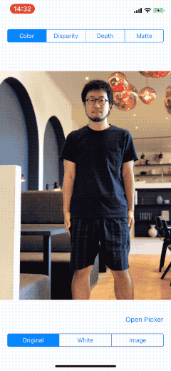
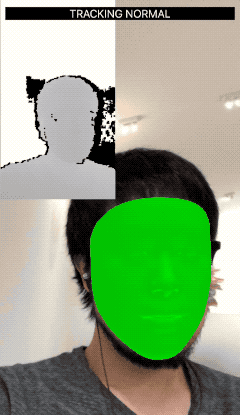
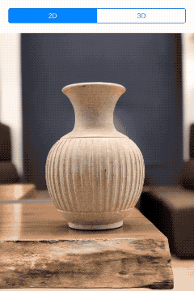

# iOS-Depth-Sampler

Code examples of Depth APIs in iOS

## Requirement

Use devices which has a **dual camera** (e.g. iPhone 8 Plus) or a **TrueDepth camera** (e.g. iPhone X)

## How to build

Open `ARKit-Sampler.xcworkspace` with Xcode 10 and build it!

It can **NOT** run on **Simulator**. (Because it uses Metal.)

## Contents

### Real-time Depth

Depth visualization in real time using AV Foundation.

### Real-time Depth Mask

Blending a background image with a mask created from depth.

### Depth from Camera Roll

Depth visualization from pictures in the camera roll.

Plaease try this after taking **a picture with the Camera app using the PORTRAIT mode**.

### Portrait Matte

Background removal demo using Portrait Effect Matte (or Portrait Effect Matte). 

Plaease try this after taking **a picture of a HUMAN with PORTRAIT mode**.

Available in iOS 12 or later.

### ARKit Depth

Depth visualization on ARKit. The depth on ARKit is available only when using `ARFaceTrackingConfiguration`.

### 2D image in 3D space

A demo to render a 2D image in 3D space.

### AR occlusion

[WIP] An occlusion sample on ARKit using depth.

## Author

**Shuichi Tsutsumi**

Freelance iOS programmer from Japan.

- PAST WORKS:  [My Profile Summary](https://medium.com/@shu223/my-profile-summary-f14bfc1e7099#.vdh0i7clr)
- PROFILES: [LinkedIn](https://www.linkedin.com/in/shuichi-tsutsumi-525b755b/)
- BLOGS: [English](https://medium.com/@shu223/) / [Japanese](http://d.hatena.ne.jp/shu223/)
- CONTACTS: [Twitter](https://twitter.com/shu223) / [Facebook](https://www.facebook.com/shuichi.tsutsumi)
